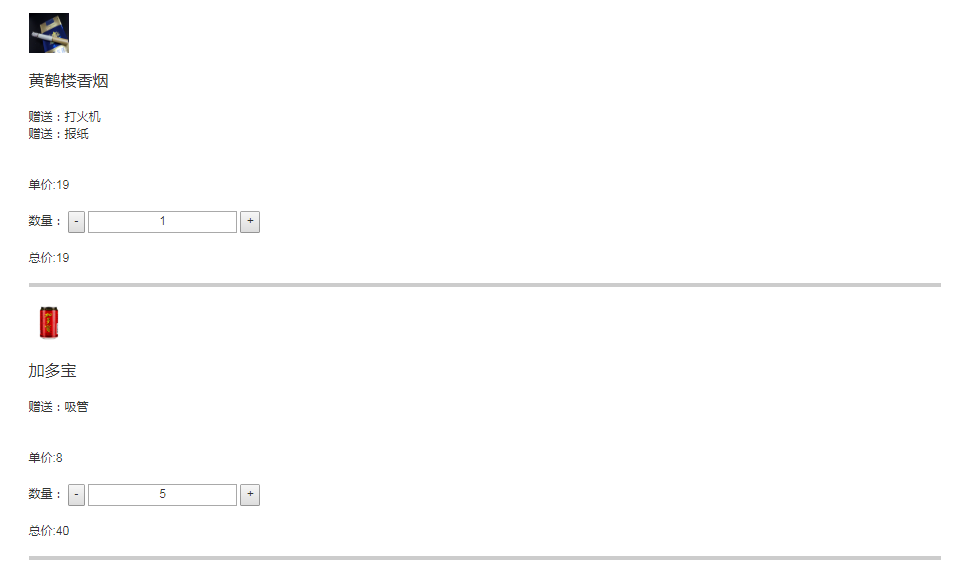
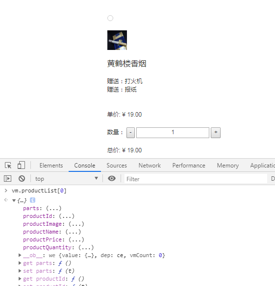
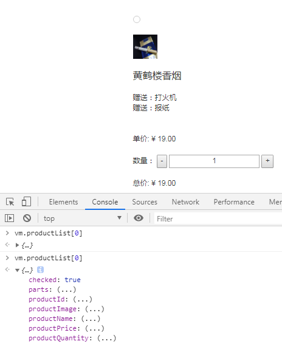
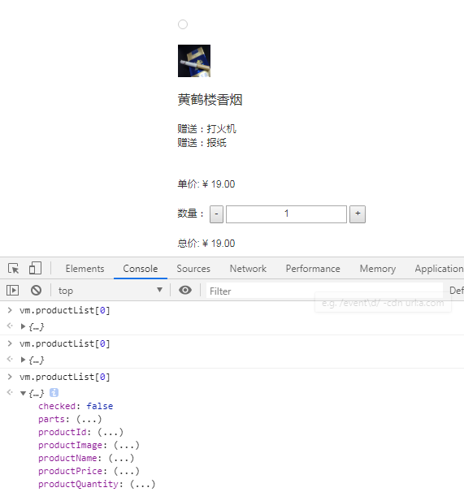

利用 Vue 实现一个简单的购物车，提供单选、全选、取消全选、增减数量、价格计算的功能

一共应用到了以下几个 Vue 的知识点：

- vue-resource
- v-for
- v-bind
- filters
- v-model
- v-on
- watch
- computed

<!-- more -->

# 后端返回的购物车数据

后端返回的购物车数据如下。`list` 就是一个一个的商品数据，比如 ID、名称、单价、个数、图片和赠品

```json
{
  "status": 1,
  "message": "",
  "result": {
    "totalMoney": 109,
    "list": [
      {
        "productId": "600100002115",
        "productName": "黄鹤楼香烟",
        "productPrice": 19,
        "productQuantity": 1,
        "productImage": "img/goods-1.jpg",
        "parts": [
          {
            "partsId": "10001",
            "partsName": "打火机",
            "imgSrc": "img/part-1.jpg"
          },
          {
            "partsId": "10002",
            "partsName": "报纸",
            "imgSrc": "img/part-1.jpg"
          }
        ]
      },
      {
        "productId": "600100002120",
        "productName": "加多宝",
        "productPrice": 8,
        "productQuantity": 5,
        "productImage": "img/goods-2.jpg",
        "parts": [
          {
            "partsId": "20001",
            "partsName": "吸管",
            "imgSrc": "img/part-2.jpg"
          }
        ]
      }
    ]
  }
}
```

# 获取后端数据

```javascript
var vm = new Vue({
    el: "#app",
    data: {
        productList: [],
    }
    mounted: function () {
        this.$nextTick(function () {
            this.cartView();
        })
    },
    methods: {
        cartView: function () {
            this.$http.get("data/cartData.json").then(res => {
                this.productList = res.data.result.list;
            });
        }
    }
});
```

`cartView` 的方法体里，使用 vue-resource 发起 HTTP GET 请求，然后获取到后端数据，并赋值给 `productList` 变量。同时，这里还用到了箭头函数。为什么要用箭头函数？

如果不用箭头函数的话，`cartView` 得这么写

```javascript
cartView: function () {
	let _this = this;
	this.$http.get("data/cartData.json").then(function(res) {
		_this.productList = res.data.result.list;
	});
}
```

因为箭头函数的作用域指向的是外层，箭头函数内的 `this` 指向的是外层的 `this`

# 使用 v-for 进行列表渲染

现在已经获取到了后端数据，并将数据存放在 `productList` 中，现在就可以使用 `v-for` 把购物车数据列表展示出来

```html
<!DOCTYPE html>
<html lang="zh-CN">
<head>
    <meta charset="utf-8">
    <meta http-equiv="X-UA-Compatible" content="IE=edge">
    <meta name="viewport" content="width=device-width, initial-scale=1">
    <title>购物车</title>

    <link href="css/bootstrap.min.css" rel="stylesheet">
</head>
<body>
<div id="app" class="container" style="margin-top: 50px;">
    <div v-for="item in productList">
        
        <br><br/>

        <span style="font-size: 20px">{{ item.productName }}</span>
        <br/><br/>

        <div v-for="part in item.parts">赠送：{{ part.partsName }}</div>
        <br/><br/>

        单价: {{ item.productPrice }}
        <br/><br/>

        数量：
        <button> - </button>
        <input v-bind:value="item.productQuantity" class="text-center">
        <button> + </button>
        <br/><br/>

        总价: {{ item.productPrice * item.productQuantity }}

        <div style="height:5px; border-bottom:5px #ccc solid; margin-top: 20px; margin-bottom: 20px"></div>
    </div>
</div>

<script src="js/lib/jquery.min.js"></script>
<script src="js/lib/bootstrap.min.js"></script>
<script src="js/lib/vue.min.js"></script>
<script src="js/lib/vue-resource.min.js"></script>
<script src="js/cart.js"></script>
</body>
</html>
```

得到的效果如图



# 使用 v-bind 绑定 HTML 标签的属性

对于文本，使用 `{{ item.productImage }}` 这样的插值表达式展示即可。如果是 `` 标签的 `src` 属性，则应该使用 `v-bind` 指令

```html

```

`v-bind` 指令就是专门用来绑定 HTML 标签的属性用的，比如 `<div v-bind:id="item.productId"></div>`、``、`<a v-bind:href="url">...</a>` 等等

# 使用过滤器（filters）格式化商品金额

后端返回的商品信息如下:

```json
{
	"productId": "600100002120",
	"productName": "加多宝",
	"productPrice": 8,
	"productQuantity": 5,
	"productImage": "img/goods-2.jpg",
	"parts": [
	  {
		"partsId": "20001",
		"partsName": "吸管",
		"imgSrc": "img/part-2.jpg"
	  }
	]
}
```

商品单价（productPrice）是纯数字，不带有人民币的符号 `¥` 也没有小数点。但是网页上需要显示人民币的符号和小数点。这时候可以使用 Vue 的过滤器（filters）

全局过滤器有两种：全局过滤器和局部过滤器。全局过滤器可以用在任何一个页面中。局部过滤器只能用在当前的 Vue 实例中

在 Vue 的实例里添加一个 filters，然后加上一个 `money` 方法

```javascript
var vm = new Vue({
    // 省略...
	
    filters: {
        money: function (value) {
            return "¥ " + value.toFixed(2);
        }
    }
	
	// 省略...
});
```

然后在数据绑定上使用 `|` 加上方法名

```html
单价: {{ item.productPrice | money }}

总价: {{ item.productPrice * item.productQuantity | money }}
```

这样就可以得到这样的效果


过滤器可以传入参数，将过滤器改为

```javascript
var vm = new Vue({
    // 省略...
	
    filters: {
        money: function (value, type) {
            return "¥ " + value.toFixed(2) + type;
        }
    }
	
	// 省略...
});
```

使用的时候这么使用

```html
单价: {{ item.productPrice | money('元') }}

总价: {{ item.productPrice * item.productQuantity | money('元') }}
```

现在效果就变成这样了


# v-model 对表单进行双向数据绑定

```
数量：
<input v-model="item.productQuantity" class="text-center">
```

修改 `<input>` 标签的值，也会更新 Vue 实例 data 中的值。同样的，更新 Vue 实例 data 中的值也会修改 `<input>` 标签的值

# 使用 v-on 监听 DOM 的点击事件，对商品数量进行增减

用户点击商品数量的增减按钮，改变商品的数量同时改变商品的总价。点击事件可以使用 `v-on:EventName` 指令。`v-on:` 可以缩写为 `@`

对商品数量进行增减，可以监听 `<button>` 的 `click` 事件

```html
数量：
<button @click="changeQuantity(item, -1)"> - </button>
<input v-model="item.productQuantity" class="text-center">
<button @click="changeQuantity(item, 1)"> + </button>
<br/><br/>
```

然后在 Vue 的实例中添加一个方法

```javascript
var vm = new Vue({
    // 省略...
	
    methods: {
        // 省略...
		
        changeQuantity: function (product, quantity) {
            if (quantity < 0 && product.productQuantity <= 1) {
                return;
            }

            product.productQuantity += quantity;
        }
    }
});
```

## v-on、v-bind 与 Vue.set() 实现选中与取消选中商品

现在定义了两个 `class`

```css
<style>
	/** 商品未选中 */
	.item-check-btn {
		display: inline-block;
		width: 16px;
		height: 16px;
		border: 1px solid #ccc;
		border-radius: 50%;
		text-align: center;
		vertical-align: middle;
		cursor: pointer;
	}

	/** 商品被选中 */
	.item-check-btn.check {
		background: #EE7A23;
		border-color: #EE7A23;
	}
</style>
```

HTML 中添加一个 `<a>` 标签，并默认应用 `item-check-btn` 的 css 样式。

```html
<a class="item-check-btn"></a>
```

然后加上一个点击事件的监听，修改商品的选中状态。如果商品选中了就应用 `check` 的 css 样式，否则就去掉 `check` 样式

```html
<a class="item-check-btn" v-bind:class="{ check: item.checked }" @click="selectProduct(item)"></a>
```

**注意：**

现在有一个问题，从后端返回的购物车数据中，商品不存在 `checked` 属性，这样应该怎么办？

按照 javascript 给对象添加属性的方法，`selectProduct` 方法的实现是这么写

```javascript
selectProduct: function (product) {
	if (typeof product.checked == 'undefined') {
		// 如果 checked 属性未定义
		product.checked = true;
	} else {
		// checked 属性已定义好了
		product.checked = !product.checked;
	}
}
```

没有选择商品的时候，`checked` 属性不存在于对象中



选中商品之后，现在对象中有了 `checked` 属性，并且值为 `true`。但是页面上没有变化



再取消选中商品，`checked` 的值变为 `false`，但是页面还是没有变化



按照 Vue 官网上的解释：

> 因为 Vue 无法探测普通的新增属性 (比如 this.myObject.newProperty = 'hi')

对于这种情况应该使用 Vue 的 [Vue.set()](https://cn.vuejs.org/v2/api/#Vue-set) 或者 [vm.$set()](https://cn.vuejs.org/v2/api/#vm-set) API

```javascript
selectProduct: function (product) {
	if (typeof product.checked == 'undefined') {
		// 如果 checked 属性未定义
		product.checked = true;
	} else {
		// checked 属性已定义好了
		product.checked = !product.checked;
	}
}
```

对于全选按钮

```html
<div style="margin-bottom: 30px">
	<a class="item-check-btn" v-bind:class="{ check: selectAllFlag }" @click="selectAll"></a> 全选
</div>
```

跟上面一样，使用 `v-bind:class` 绑定 css 的样式，用 `v-on:click` 监听 `click` 事件

```javascript
selectAll: function () {
	this.selectAllFlag = !this.selectAllFlag;

	this.productList.forEach((product, index) => {
		if (typeof product.checked == 'undefined') {
			this.$set(product, 'checked', this.selectAllFlag);
		} else {
			product.checked = this.selectAllFlag;
		}
	});
}
```

# 计算商品的总金额

```html
<div style="margin-bottom: 30px">
	总金额：{{ totalPrice | money }}
</div>
```

## 普通实现

执行增减数量、选中与取消选中、删除操作时，商品总金额会发生变化，增加一个计算总价的方法

```javascript
calcTotalPrice: function () {
	this.totalPrice = 0;
	this.productList.forEach((product, index) => {
		if (product.checked == true) {
			this.totalPrice += (product.productPrice *  product.productQuantity);
		}
	});
}
```

然后把 `calcTotalPrice` 方法放到几个操作商品方法的方法体最后面

```javascript
var vm = new Vue({
    // 省略...
	
    methods: {
        changeQuantity: function (product, quantity) {
            // 省略...
			
			this.calcTotalPrice();
        },
        selectProduct: function (product) {
            // 省略...
			
			this.calcTotalPrice();
        },
        selectAll: function () {
            // 省略...

            this.calcTotalPrice();
        },
        calcTotalPrice: function () {
            this.totalPrice = 0;
            this.productList.forEach((product, index) => {
                if (product.checked == true) {
                    this.totalPrice += (product.productPrice *  product.productQuantity);
                }
            });
        }
    }
});
```

## 利用 watch 监听数据的变化，然后计算总金额

利用 Vue 的 `watch` 监听 Vue 实例的 `data` 的变化，然后计算总金额

**有个要注意到地方：**

> 为了发现对象内部值的变化，可以在选项参数中指定 `deep: true`

为了监听商品的选中状态、数量的变化，所以需要加上 `deep: true`

```javascript
var vm = new Vue({
	// 省略...
	
	data: {
        totalPrice: 0
    },	
    watch: {
        productList: {
            handler: function(newVal, oldVal) {
                this.calcTotalPrice();
            },
            deep: true
        }
    },
    methods: {
        calcTotalPrice: function () {
            this.totalPrice = 0;
            this.productList.forEach((product, index) => {
                if (product.checked == true) {
                    this.totalPrice += (product.productPrice *  product.productQuantity);
                }
            });
        }
    }
});
```

## 利用计算属性来计算总金额

```javascript
var vm = new Vue({
    // 省略...
	
    computed: {
        totalPrice: function () {
            let result = 0;
            this.productList.forEach((product, index) => {
                if (product.checked == true) {
                    result += (product.productPrice *  product.productQuantity);
                }
            });
            return result;
        }
    }
});
```

这时候 `data` 就不需要再定义 `totalPrice` 变量了，HTML 页面上直接使用计算属性 `totalPrice` 的名称即可

```html
<div style="margin-bottom: 30px">
	总金额：{{ totalPrice | money }}
</div>
```

# 使用数组的 split 方法删除商品

加一个 `<button>` 标签，并添加点击事件。这没什么难的，但是有个需要注意的地方：

**方法名不要和 Vue 的自带方法名重复了**

比如我定义的 `delete` 方法就和 Vue 自带的 delete 方法重复了

```javascript
delete: function (product) {
	let index = this.productList.indexOf(product);
	this.productList.splice(index, 1);
}
```

点击 `<button>` 却没有删除商品。换一个方法名就好了

```javascript
deleteProduct: function (product) {
	let index = this.productList.indexOf(product);
	this.productList.splice(index, 1);
}
```

这样点击删除按钮就能删除商品了
